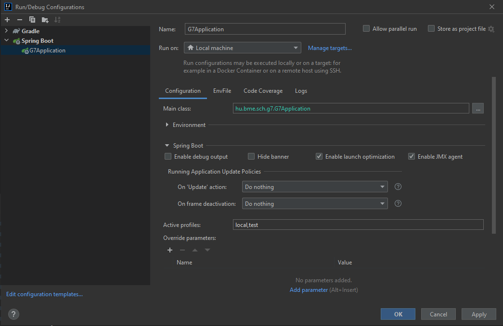

CMSch web backend with in-built frontend
===

## Build docker

```bash
  ./gradlew clean build
  docker build -t cmsch .
```

## Run

```bash
  ./gradlew bootRun --args='--spring.profiles.include=test,internal'
```

## Publish

Use your authsch details for docker login. Tag `rc` for staging (release candidate) and tag release for release.

```bash
  docker login harbor.sch.bme.hu
  
  # Release candidate
  docker image tag cmsch:latest harbor.sch.bme.hu/org-golyakorte/cmsch:rc
  docker image push harbor.sch.bme.hu/org-golyakorte/cmsch:rc
  
  # Release (you can use versions like ':major.minor.build' as well)
  docker image tag cmsch:latest harbor.sch.bme.hu/org-golyakorte/cmsch:release
  docker image push harbor.sch.bme.hu/org-golyakorte/cmsch:release
```

## Run (you can start here)

For develpment:

```bash
  docker run --rm -p 8080:80 \
        -e AUTHSCH_CLIENT_ID=20_CHARS \
        -e AUTHSCH_CLIENT_KEY=80_CHARS \
        -e PROFILE_SALT=RANDOM_STRING \
        -e SYSADMINS=YOUR_AUTH_SCH_UUID \
        cmsch
```

or from the registry: **YOU MIGHT PROBABLY WANT TO START WITH THIS**

```bash
  docker pull harbor.sch.bme.hu/org-golyakorte/cmsch
  docker run --rm -p 8080:80 \
        -e AUTHSCH_CLIENT_ID=20_CHARS \
        -e AUTHSCH_CLIENT_KEY=80_CHARS \
        -e PROFILE_SALT=RANDOM_STRING \
        -e SYSADMINS=YOUR_AUTH_SCH_UUID \
        harbor.sch.bme.hu/org-golyakorte/cmsch
```

## Where to start?

- Api docs: BASE_URL/swagger-ui.html
- Admin UI: BASE_URL/admin/control/basics
- API: BASE_URL/api/... (see swagger for more)

## Required apps

You must install:

- Node v16
- Yarn v1.22.17
- IDEA or at least Gradle

## Application local properties

Create an application-local.properties file in the `src/main/resources/config` folder, 
and fill the file with these configurations (using your credentials): 

```properties
authsch.client-identifier=<insert the shorter key>
authsch.client-key=<insert the long key>
cmsch.sysadmins=<your pekId>
cmsch.website-default-url=http://<your ip>:8080/
logging.level.web=DEBUG
```

Your pekId can be found in the console log of the Spring app when signing in with AuthSCH. The `cmsch.website-default-url`
property's IP address needs to be either `localhost` or the IP of your current device running your Spring app on your network.

Once created, edit the `CMSchApplication` Run Configuration's Spring Boot Active Profiles to use (see image down below)

- `local,test` if you want test data in the database also
- `local` if you don't



## Client side solutions

### Hybrid solution: SPA client built statically for the Spring app

The React client is built into the Spring app upon triggering a Gradle build. 

### In production mode

The gradle building task will build the React app's built JS files into the static directory of our Spring app, from 
where the Spring backend app will serve the built js files, they will access easily the Spring app backend through axios
API. This will not induce CORS related problems, both the backend and these static files will be served by Tomcat in 
Spring app's domain.

If you need to declare a new client environment variable, create it in the `src/main/resources/configurations/application.properties`
file and modify the `build.gradle.kts` script (approx. line 97) to include the new property in the built .env file.

When in development mode, you can freely change the .env file. **WARNING**: Gradle build will override the existing .env
file so always have an .env.development file in the client repo as a backup.

### Recommended development workflows

### Basic recommended development workflow

#### FOR BACKEND DEVELOPMENT 

Open up IDEA, start the Spring app, you're good to go.

#### FOR FRONTEND DEVELOPMENT

1. Open up `src/main/client` in VSCode or Webstorm, open a terminal there.
2. `yarn install` to install dependencies locally in node_modules
3. `yarn start` to start React client server **DEPRECATED**: while using React dev-server, you won't be able to make
proper API calls or use session handling so you won't be able to log into the Spring app.
4. `yarn spring:start-app` to start the Spring app easily.

Once the Spring server is running on [localhost:8080](http://localhost:8080), you need to open this url, where you can 
see your React frontend in *production* mode. 

**IMPORTANT AND USEFUL TIP:** Anytime you need to see your modifications without the need of restarting the Spring app, 
**do not** close the terminal running the Spring app, but open a new terminal and use the `yarn spring:build-ui` command
in the client-side project root.

Be wise with using the `yarn spring:build-ui` script, as it takes approx. 1 minute to rebuild the React frontend and move
it into the Spring app's static resources files.

The last two yarn commands work from Windows, use `yarn spring:start-app-alt` and `yarn spring:build-ui-alt` if you're
using MaxOS or Linux base systems.

If you need to declare a new environment variable, create it in the `src/main/resources/configurations/application.properties`
file and modify the `build.gradle.kts` script (approx. line 97) to include the new property in the built .env file.
